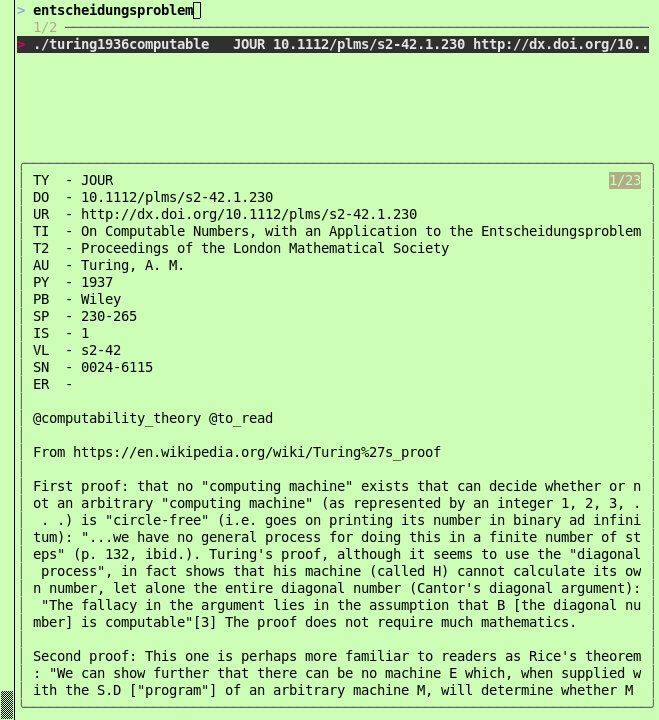

# miniref: Minimalist Reference Management Using the Command Line
miniref is an experiment at creating an **academic reference manager** (in the sense of [Zotero](https://www.zotero.org)), but for the **command line** and with a **minimalist flavour**. It is strongly inspired by projects like [Cobib](https://mrossinek.gitlab.io/programming/introducing-cobib/) and [fast-p](https://github.com/bellecp/fast-p) (the latter which appears to originate the idea of using `fzf` for searching PDF literature).

**Note: This is an alpha stage project**.

# Requirements
* [fzf](https://github.com/junegunn/fzf) (available via many OS package managers)
* xpdf
* Standard Unix/Linux shell utilities (originally developed under OpenBSD 7.3 against `sh`; POSIX compliance not guaranteed).
* Python 3 (no external package dependencies)

# Installation
* Install [fzf](https://github.com/junegunn/fzf)
* Copy [scripts](scripts) to a location on your `$PATH` (e.g. `~/bin`; redefine `PATH=$PATH:$HOME/bin` in your `.profile` if necessary)
* Optional: `export MINIREF_HOME=/path/to/my/references` in your `.profile` (defaults to `$HOME/miniref`)
* Optional: Add [suggested aliases and functions](aliases/aliases) to your shell config (e.g. `.bashrc`)
  
# Introduction
The basic idea is that each reference is a directory with a human-interpretable and meaningful name that we will call the **reference identifier**. A suggested naming scheme is *firstAuthorSurname* + *publicationYear* + *firstTitleKeyWord*. For example, we might use *turing1936computable* as the reference identifier for A.M. Turing's 1936 paper *"On Computable Numbers, with an Application to the Entscheidungsproblem"*.

# Currently Implemented Features
miniref currently implements the following features:

## Managing References
```
refman.py -e -s https://www.cs.virginia.edu/~robins/Turing_Paper_1936.pdf turing1936computable
```
creates the directory `turing1936computable` at location `$MINIREF_HOME` and populates the newly created directory with the specified PDF file (both HTTP(S) URLs and local paths are supported). In addition, the newly created directory is populated with a minimal `ref.ris` file, for storing citation information (e.g. author, title, publication year) in [RIS (RefMan)](https://en.wikipedia.org/wiki/RIS_(file_format)) format. Thus, `$MINIREF_HOME` now looks like this:
```
miniref/
`-- turing1936computable
    |-- Turing_Paper_1936.pdf
    `-- ref.ris
```

In the previous command, the `-e` flag opens `ref.ris` in `$EDITOR`, for manual entry of citation information. Note that in Google Scholar, you can get RIS-formatted citation information by selecting 'Cite' → 'RefMan' for a search result. If you set your browser to open files of this type in-place, you can make use of the `-e` flag for pasting citation information from Google Scholar.

Instead of relying on manual RIS data entry, it is alternatively possible to fetch RIS data automatically, by providing a DOI. We can amend our existing reference as follows:
```
refman.py -i doi:10.1112/plms/s2-42.1.230 turing1936computable
```
We can also use `refman.py` as follows, to the same effect:
```
cd $MINIREF_HOME/turing1936computable
refman.py -i doi:10.1112/plms/s2-42.1.230 .
```

### Tagging a Reference
```
refman.py -t @to_read -t @computabilty_theory turing1936computable
```
assigns the tags `@to_read` and `@computability_theory` to our reference, using the file `tags` to store tags. Thus, `$MINIREF_HOME` now looks like this:
```
miniref/
`-- turing1936computable
    |-- Turing_Paper_1936.pdf
    |-- ref.ris
    `-- tags
```
We can untag a reference (i.e. remove a specified tag) as follows:
```
refman.py -u @to_read turing1936computable
```

## Searching and Viewing References
Use `refsearch.sh` to search using [fzf](https://github.com/junegunn/fzf). You should see something like this:



The left-hand pane displays a list of references. For the selected reference, the right-hand pane displays:
* **Citation information** (`ref.ris`)
* **Tags** (`tags`)
* **Notes** (`cat` of `.txt` files)

**Incremental search** (i.e. by typing) is currently applied to:
* Reference identifiers
* Contents of `ref.ris` file
* Contents of `tags` file
* Contents of any `.txt` files (e.g. notes)

**Hitting Enter ↵ executes a shell** in the directory of the selected reference.

**Hitting F1 opens the first PDF** (if available) of the selected reference.

# Roadmap
* Use --listen to request refresh-preview() and reload() on file change using inotify
* PDF full-text search / keyword extraction
